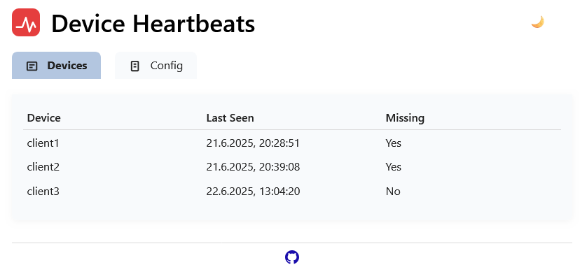

# Dead Man's Switch

A Go-based tool that monitors for regular HTTP POST updates from another application. If updates stop, it sends notifications via configurable channels (email/SMTP, Telegram, dummy, etc.).



## Features

- Monitors HTTP POST updates from clients
- Sends notifications via multiple, configurable channels (SMTP, Telegram, dummy, etc.)
- Configurable via `config.yaml` or environment variables
- Simple web frontend (with htmx) to view device status and notification config
- Runs natively (Windows/Linux) or in Docker
- Multi-platform builds and Docker image publishing (amd64, arm64, arm/v7)
- Extensible notification system (pluggable channels)
- Includes tests and CI/CD

## Quick Start

### 1. Configuration

Create a `config.yaml` file in the working directory. Example:

```yaml
listen_addr: ":8080"
timeout_seconds: 600           # timeout in seconds (>60)
notification_channels:
  - type: smtp
    to: "user@example.com"
    smtp_server: "smtp.example.com"
    smtp_port: "587"           # 25 (plain), 465 (ssl), 587 (starttls)
    smtp_user: "user"
    smtp_pass: "pass"
    smtp_from: "sender@example.com" # optional, defaults to smtp_user
    smtp_security: "starttls"  # plain, ssl, or starttls
  - type: telegram
    bot_token: "123456:ABC-DEF1234ghIkl-zyx57W2v1u123ew11"
    chat_id: "-123456789"
  - type: dummy
    to: "test@example.com"
notification_messages:
  timeout: "No heartbeat from {{name}}! Last seen {{duration}} ago. Please check the device."
  recovery: "Device {{name}} has recovered and is sending heartbeats again."
```

You can override any config value with environment variables (e.g., `LISTEN_ADDR`, `TIMEOUT_SECONDS`):

- `notification_messages.timeout`: Message sent when a device times out. Supports `{{name}}` and `{{duration}}` variables.
- `notification_messages.recovery`: Message sent when a device recovers. Supports `{{name}}` variable.

### 2. Running the Server

#### Native (Windows/Linux)

```sh
mkdir -p build
GOOS=linux  GOARCH=amd64 go build -o build/dead-mans-switch-linux-amd64 .
GOOS=linux  GOARCH=arm64 go build -o build/dead-mans-switch-linux-arm64 .
GOOS=windows GOARCH=amd64 go build -o build/dead-mans-switch-windows-amd64.exe .
./build/dead-mans-switch-linux-amd64 # or the appropriate binary for your OS
```

To include build metadata (build time and git commit) in the binary:

```sh
BUILD_TIME=$(date -u +"%Y-%m-%dT%H:%M:%SZ")
GIT_COMMIT=$(git rev-parse --short HEAD)
go build -ldflags "-X main.BuildTime=${BUILD_TIME} -X main.GitCommit=${GIT_COMMIT}" -o dead-mans-switch .
```

All local build artifacts are written to the `/build` directory.

#### Docker

**Bash:**

```sh
# Build with metadata
docker build \
  --build-arg BUILD_TIME="$(date -u +%Y-%m-%dT%H:%M:%SZ)" \
  --build-arg GIT_COMMIT="$(git rev-parse --short HEAD)" \
  -t ghcr.io/crashlooping/dead-mans-switch/dead-mans-switch:latest .

# Run
docker run -v $(pwd)/config.yaml:/app/config.yaml -p 8080:8080 ghcr.io/crashlooping/dead-mans-switch/dead-mans-switch:latest
```

**PowerShell:**

```powershell
# Build with metadata
docker build `
  --build-arg BUILD_TIME="$(Get-Date -Format 'yyyy-MM-ddTHH:mm:ssZ' -AsUTC)" `
  --build-arg GIT_COMMIT="$(git rev-parse --short HEAD)" `
  -t ghcr.io/crashlooping/dead-mans-switch/dead-mans-switch:latest .

# Run
docker run -v "${PWD}/config.yaml:/app/config.yaml" -p 8080:8080 ghcr.io/crashlooping/dead-mans-switch/dead-mans-switch:latest
```

**Windows CMD:**

```cmd
REM Build with metadata (requires Git for Windows)
for /f %%i in ('git rev-parse --short HEAD') do set GIT_COMMIT=%%i
docker build --build-arg BUILD_TIME="%date:~10,4%-%date:~4,2%-%date:~7,2%T%time:~0,8%Z" --build-arg GIT_COMMIT="%GIT_COMMIT%" -t ghcr.io/crashlooping/dead-mans-switch/dead-mans-switch:latest .

REM Run
docker run -v "%cd%/config.yaml:/app/config.yaml" -p 8080:8080 ghcr.io/crashlooping/dead-mans-switch/dead-mans-switch:latest
```

#### Docker (plain)

To run with plain Docker (no Compose):

1. Build or pull the image (replace with your desired version/tag):

```sh
docker pull ghcr.io/crashlooping/dead-mans-switch/dead-mans-switch:latest
```

1. Make sure you have a `config.yaml` in your current directory. Example config is shown above.

1. (Recommended) Create a persistent data directory for BoltDB:

```sh
mkdir -p ./data
```

1. Run the container, mounting your config and data directories, and exposing port 8080:

```sh
docker run -d \
  --name dead-mans-switch \
  -v $(pwd)/config.yaml:/app/config.yaml:ro \
  -v $(pwd)/data:/app/data \
  -p 8080:8080 \
  ghcr.io/crashlooping/dead-mans-switch/dead-mans-switch:latest
```

- The `-v $(pwd)/config.yaml:/app/config.yaml:ro` mounts your config file read-only into the container.
- The `-v $(pwd)/data:/app/data` mounts a persistent data directory for BoltDB storage.
- The `-p 8080:8080` exposes the web UI and API on port 8080.

You can stop and remove the container with:

```sh
docker stop dead-mans-switch && docker rm dead-mans-switch
```

#### Docker Compose

A sample [`docker-compose.yaml`](docker-compose.yaml) is provided for easy deployment:

```sh
docker compose up -d
```

This will start the service, mount your config and data, and expose port 8080.

### 3. Web Frontend

Visit [http://localhost:8080/](http://localhost:8080/) in your browser to view:

- A live-updating table of all device heartbeats and status
- A list of all configured notification channels (with sensitive fields masked)
- Build information (build time and git commit) in the footer
- A link to the GitHub repository

The frontend is built with [htmx](https://htmx.org/) and [Water.css](https://watercss.kognise.dev/) for a modern, minimal look.

### 4. Sending Heartbeats

Send a heartbeat (HTTP POST) to keep the switch alive:

#### curl

```sh
curl -X POST http://localhost:8080/heartbeat -H "Content-Type: application/json" -d '{"name": "client1"}'
```

#### wget

```sh
wget --method=POST --header="Content-Type: application/json" --body-data='{"name": "client1"}' http://localhost:8080/heartbeat
```

#### PowerShell

```powershell
Invoke-WebRequest -Uri http://localhost:8080/heartbeat -Method POST -Body '{"name": "client1"}' -ContentType 'application/json'
```

## Persistent Storage

The tool stores all heartbeats in a BoltDB database file at `./data/heartbeats.db` by default. When running in Docker, the `data` directory is mounted as a persistent volume.

## Running Behind a Reverse Proxy (BASE_PATH)

If you want to serve the app under a subpath (e.g., `https://yourdomain.com/dead-mans-switch`) behind a reverse proxy (such as Traefik or Nginx), set the `BASE_PATH` environment variable:

```text
BASE_PATH=/dead-mans-switch
```

This will prefix all routes (web UI, API, static files) with `/dead-mans-switch`, so your app is accessible at `https://yourdomain.com/dead-mans-switch/web` and all links, redirects, and API endpoints will work correctly.

**Docker Compose example:**

```yaml
services:
  dead-mans-switch:
    image: ghcr.io/crashlooping/dead-mans-switch/dead-mans-switch:latest
    environment:
      - TZ=Europe/Berlin
      - BASE_PATH=/dead-mans-switch
    # ...other config...
```

**Note:**

- Your reverse proxy must also be configured to forward requests from the subpath to the container.
- If you run the app at the root (e.g., `https://yourdomain.com/`), you do not need to set `BASE_PATH`.

## Building and CI/CD

- Binaries for Windows (x64) and Linux (x64, ARM) are built via GitHub Actions with embedded build metadata (build time and git commit).
- Docker images are built and pushed to the GitHub Container Registry for all major platforms.
- Multi-arch Docker images are available under the `:latest` tag.
- Build metadata is displayed in the web UI footer and logged during startup for version tracking.

## Extending Notifications

Notification channels are pluggable. Add new types by implementing the `Notifier` interface in Go and registering them.

## Tests

Run tests with:

```sh
go test ./...
```

## Health Check

A simple health endpoint is available at `/up`:

```sh
curl -i http://localhost:8080/up
```

This will return ```HTTP/1.1 200 OK```

You can use this endpoint for monitoring and readiness/liveness checks in Docker, Kubernetes, or other orchestration systems.

### Git Hooks with Lefthook

This project uses [Lefthook](https://github.com/evilmartians/lefthook) to run `golangci-lint` automatically before each commit.

**Setup:**

```sh
# Install lefthook (if not already installed)
go install github.com/evilmartians/lefthook@latest

# Install git hooks
lefthook install
```

Now, every commit will run `golangci-lint run --enable=unused --tests=false` and block the commit if there are any linter errors.

---

**Note:** Some UI icons are from [Heroicons](https://heroicons.com/).

*This project was built and iteratively improved with the help of GitHub Copilot.*

For more details, see inline comments, the [web frontend](web/index.html), and [GitHub](https://github.com/crashlooping/dead-mans-switch/).
